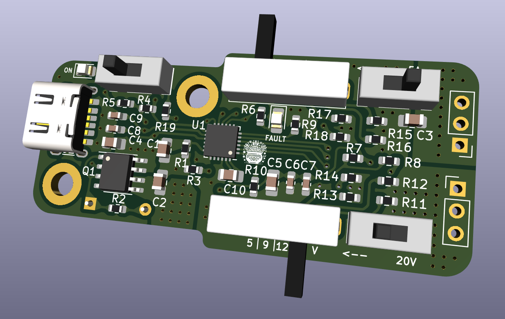
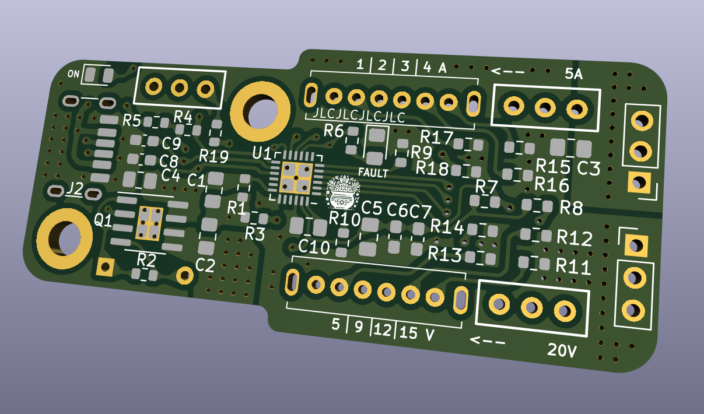
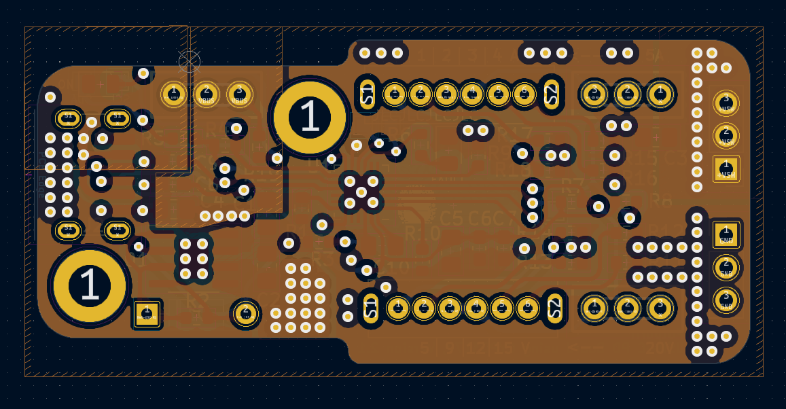

# USB Type-C PD Voltage and Current Selection PCB

This PCB is designed to provide selectable output voltages and currents using the Infineon CYPD3177 USB Type-C port controller. It's equipped with switches that allow you to set the output voltage to 5V, 9V, 12V, 15V, or 20V and the current to 1A, 2A, 3A, 4A, or 5A.

## Features

- **USB Type-C Controller**: CYPD3177 with integrated fault protection and wide operating temperature range.
- **Selectable Output Voltage**: 5V, 9V, 12V, 15V, or 20V.
- **Selectable Output Current**: 1A, 2A, 3A, 4A, or 5A.
- **Compact Design**: Suitable for a variety of applications, including power tools, wearables, IoT devices, and more.
- **Turn ON Switch**: Switch to turn ON/OFF module.

## Voltage and Current Settings

The output voltage and current can be adjusted using switches on the PCB. SW1 is a SP4T switch and SW2 is a SPST switch. To use SW1, SW2 must be in position 1.  Refer to the table below for the settings:

| Voltage Setting | Output Voltage |
|-----------------|----------------|
| SW1-1           | 5V             |
| SW1-2           | 9V             |
| SW1-3           | 12V            |
| SW1-4           | 15V            |
| SW2-2           | 20V            |

| Current Setting | Output Current |
|-----------------|----------------|
| SW1-1           | 1A             |
| SW1-2           | 2A             |
| SW1-3           | 3A             |
| SW1-4           | 4A             |
| SW2-2           | 5A             |

## Images

### Schematic

### 3D Renderings
- Front View: 
- Front View without components: 
- Back View: 

### PCB
**4-Layer Stackup**: Signal Layer, GND Layer, Power Layer, Signal Layer
- All layers: 
- Front traces: 
- GND plane: 
- PWR plane: 
- Back traces: 

## Usage

1. **Output Voltage Selection**: Set the desired output voltage by configuring the appropriate switch on the PCB.
2. **Current Selection**: Set the desired current by adjusting the appropriate switch according to the table above.
3. **Connect Device**: Connect the device to the USB Type-C port.
4. **Power Input**: Provide power via the USB Type-C input, and the circuit will manage safe power delivery and maintain output stability.

---

This PCB is ideal for applications needing flexible power delivery with selectable voltage and current options.
